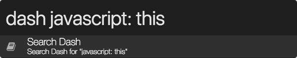

## Zazu-Dash

Search Dash (or Zeal if you are on Windows/Linux) directly from Zazu!

### Usage
Enter "Dash" followed by your search. Results open in a Dash (or Zeal) window.

To search a specific language, place the language followed by a colon (following space optional) before your query. 

I.E. `dash javascript:this` or `dash javascript: this`.



### Installing
Add `fracturedloop/zazu-dash` inside of the `plugins` of your `~/.zazurc.json` file.

```
{
  "plugins": [
    "fracturedloop/zazu-dash"
  ]
}
```
